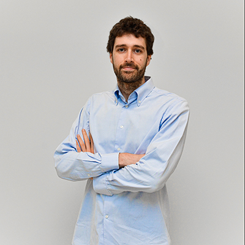

```{css, echo=FALSE}
#header {
    display: none;
}
```

```{css, echo=FALSE}
.myimg {
  height: 120px;
  width: 120px;
  border-radius: 50%;
  object-fit: cover;
  border: thick double black;
}
```

```{css, echo=FALSE}
h1, h2, h3{
  text-align: center;
}
```
<h1>Meet the Team</h1>

<h2>Director</h2>

<center>
```{r, echo=FALSE, out.extra='class="myimg"', fig.cap= "[Lea Petrella](petrella.html) <br> Professor of Statistics <br> La Sapienza University"}
knitr::include_graphics("images/petrella.jpeg")
``` 
</center>

<br>

<h2>Fellows</h2>

<center>
:::::::::::::: {class='row'}
<!-- ::: {class='col-sm-4'} -->

<!-- ```{r img-with-knitr, echo=FALSE, out.extra='class="myimg"', fig.cap= "[Lea Petrella](https://quantileregressionlab.github.io/petrella.html)"} -->
<!-- knitr::include_graphics("images/petrella.jpeg") -->
<!-- ```  -->

<!-- ::: -->
::: {class='col-sm-6'}

```{r, echo=FALSE, out.extra='class="myimg"', fig.cap= "[Nicola Salvati](salvati.html) <br> Professor of Statistics <br> University of Pisa"}

``` 

:::

::: {class='col-sm-6'}

```{r, echo=FALSE, out.extra='class="myimg"', fig.cap= "[Luca Merlo](merlo.html) <br> Researcher <br> European University of Rome"}

``` 

:::
::::::::::::::
</center>


<br>

<!-- - [Lea Petrella](https://beatricefor.github.io/quantile-website-test-pages/petrella.html) -->
<!-- - [Nicola Salvati](https://beatricefor.github.io/quantile-website-test-pages/salvati.html) -->
<!-- - [Luca Merlo](https://beatricefor.github.io/quantile-website-test-pages/merlo.html) -->

<h2>Post-docs</h2>
<center>
```{r, echo=FALSE, out.extra='class="myimg"', fig.cap= "[Beatrice Foroni](foroni.html) <br> Post-doc <br> La Sapienza University"}
knitr::include_graphics("images/foroni.jpg")
``` 
</center>
<!-- - [Beatrice Foroni](https://beatricefor.github.io/quantile-website-test-pages/foroni.html) -->

<br>

<h2>PhD Students</h2>
<center>
:::::::::::::: {class='row'}
::: {class='col-sm-6'}

```{r, echo=FALSE, out.extra='class="myimg"', fig.cap= "[Mila Andreani](andreani.html) <br> PhD Student <br> Scuola Normale Superiore of Pisa"}
knitr::include_graphics("images/andreani.jpeg")
``` 
:::

::: {class='col-sm-6'}

```{r, echo=FALSE, out.extra='class="myimg"', fig.cap= "[Maria Saiz](saiz.html) <br> PhD Student <br> La Sapienza University"}
knitr::include_graphics("images/saiz.jpeg")
``` 

:::
::::::::::::::
</center>


<!-- - Maria Saiz -->
<!-- - Mila Andreani -->

