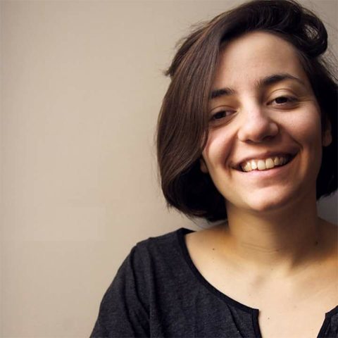
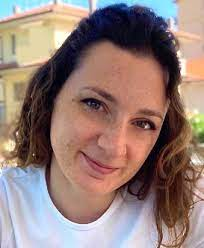

```{css, echo=FALSE}
#header {
    display: none;
}
```

```{css, echo=FALSE}
.myimg {
  height: 80px;
  width: 80px;
  border-radius: 50%;
  object-fit: cover;
}
```

```{css, echo=FALSE}
h1, h2, h3 {
  text-align: center;
}
```
# Meat the Team

### Faculty Members

<center>
:::::::::::::: {class='row'}
::: {class='col-sm-4'}

```{r img-with-knitr, echo=FALSE, out.extra='class="myimg"', fig.cap= "[Lea Petrella](https://beatricefor.github.io/quantile-website-test-pages/petrella.html)"}
knitr::include_graphics("images/petrella.jpeg")
``` 

:::
::: {class='col-sm-4'}

```{r, echo=FALSE, out.extra='class="myimg"', fig.cap= "[Nicola Salvati](https://beatricefor.github.io/quantile-website-test-pages/salvati.html)"}
knitr::include_graphics("images/salvati2.jpeg")
``` 

:::

::: {class='col-sm-4'}

```{r, echo=FALSE, out.extra='class="myimg"', fig.cap= "[Luca Merlo](https://beatricefor.github.io/quantile-website-test-pages/merlo.html)"}
knitr::include_graphics("images/merlo.jpeg")
``` 

:::
::::::::::::::
</center>


<!-- - [Lea Petrella](https://beatricefor.github.io/quantile-website-test-pages/petrella.html) -->
<!-- - [Nicola Salvati](https://beatricefor.github.io/quantile-website-test-pages/salvati.html) -->
<!-- - [Luca Merlo](https://beatricefor.github.io/quantile-website-test-pages/merlo.html) -->

### Post-docs
<center>
```{r, echo=FALSE, out.extra='class="myimg"', fig.cap= "[Beatrice Foroni](https://beatricefor.github.io/quantile-website-test-pages/foroni.html)"}

``` 
</center>
<!-- - [Beatrice Foroni](https://beatricefor.github.io/quantile-website-test-pages/foroni.html) -->

### PhD Students
<center>
:::::::::::::: {class='row'}
::: {class='col-sm-6'}

```{r, echo=FALSE, out.extra='class="myimg"', fig.cap= "[Mila Andreani](https://beatricefor.github.io/quantile-website-test-pages/andreani.html)"}

``` 
:::

::: {class='col-sm-6'}

```{r, echo=FALSE, out.extra='class="myimg"', fig.cap= "[Maria Saiz](https://beatricefor.github.io/quantile-website-test-pages/saiz.html)"}
knitr::include_graphics("images/saiz.jpeg")
``` 

:::
::::::::::::::
</center>


<!-- - Maria Saiz -->
<!-- - Mila Andreani -->

